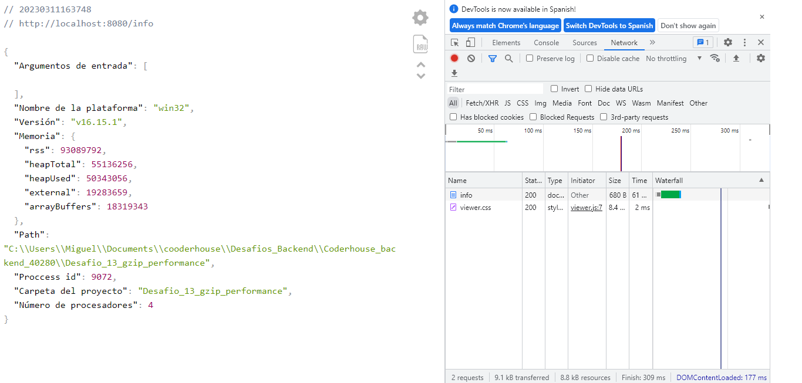
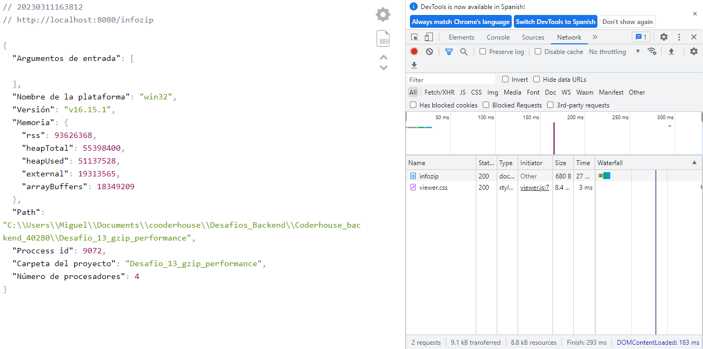
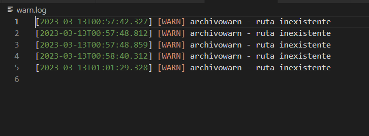
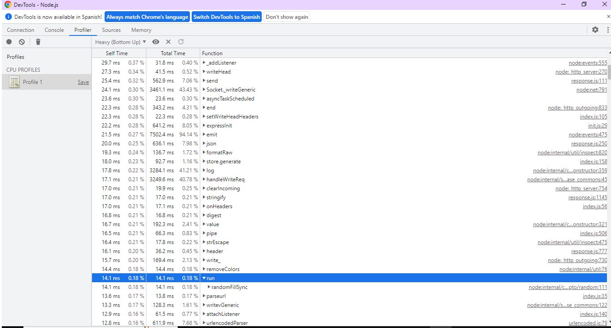
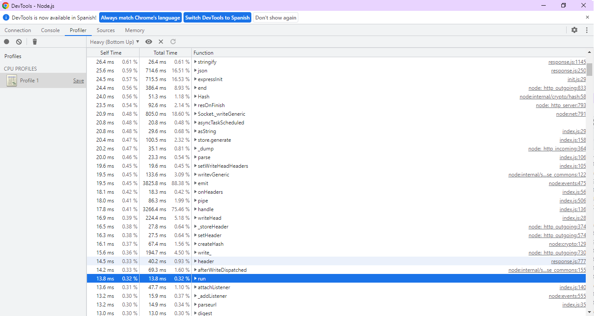
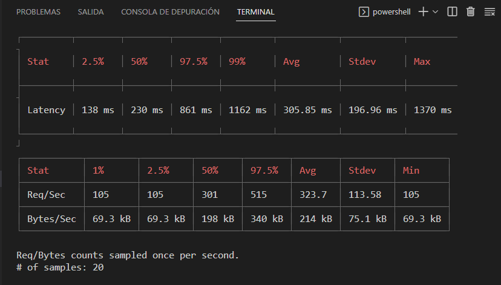
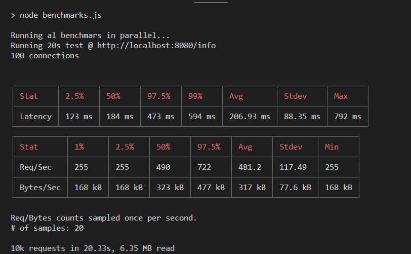
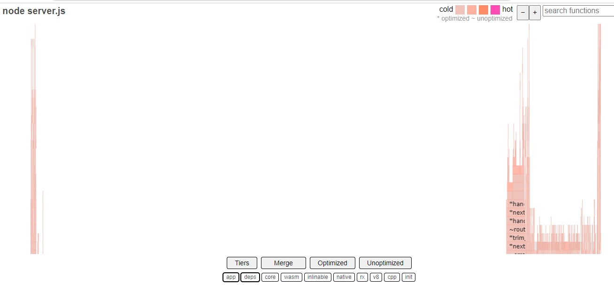
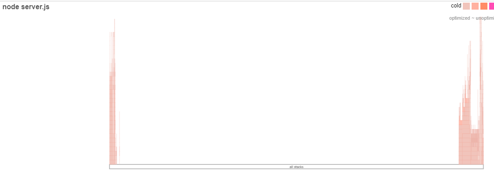

# LOGGERS Y GZIP
Incorporar al proyecto de servidor de trabajo la compresión gzip.
Verificar sobre la ruta /info con y sin compresión, la diferencia de cantidad de bytes devueltos en un caso y otro.

Luego implementar loggueo (con alguna librería vista en clase) que registre lo siguiente:
- Ruta y método de todas las peticiones recibidas por el servidor (info)
- Ruta y método de las peticiones a rutas inexistentes en el servidor (warning)
- Errores lanzados por las apis de mensajes y productos, únicamente (error)

Considerar el siguiente criterio:
- Loggear todos los niveles a consola (info, warning y error)
- Registrar sólo los logs de warning a un archivo llamada warn.log
- Enviar sólo los logs de error a un archivo llamada error.log

# ANALISIS DE PERFORMANCE
Luego, realizar el análisis completo de performance del servidor con el que venimos trabajando.
Vamos a trabajar sobre la ruta '/info', en modo fork, agregando ó extrayendo un console.log de la información colectada antes de devolverla al cliente. Además desactivaremos el child_process de la ruta '/randoms'
Para ambas condiciones (con o sin console.log) en la ruta '/info' OBTENER:
1- El perfilamiento del servidor, realizando el test con --prof de node.js. Analizar los resultados obtenidos luego de procesarlos con --prof-process. 
Utilizaremos como test de carga Artillery en línea de comandos, emulando 50 conexiones concurrentes con 20 request por cada una. Extraer un reporte con los resultados en archivo de texto.
Luego utilizaremos Autocannon en línea de comandos, emulando 100 conexiones concurrentes realizadas en un tiempo de 20 segundos. Extraer un reporte con los resultados (puede ser un print screen de la consola)
2- El perfilamiento del servidor con el modo inspector de node.js --inspect. Revisar el tiempo de los procesos menos performantes sobre el archivo fuente de inspección.
3- El diagrama de flama con 0x, emulando la carga con Autocannon con los mismos parámetros anteriores.
Realizar un informe en formato pdf sobre las pruebas realizadas incluyendo los resultados de todos los test (texto e imágenes). 
👉 Al final incluir la conclusión obtenida a partir del análisis de los datos.

## RESOLUCION DE DESAFIO

**GZIP**

Codiicación 

```
const compression = require("compression")

router.get("/info", getDatos);
router.get("/infozip", compression(), getDatos);

```



**LOGUEO CON LOG4JS**
```
const log4js = require("log4js")

log4js.configure(
    {
        appenders: {
            consola: { type: "console" },
            archivoWarnings: { type: "file", filename: "warn.log" },
            archivoErrores: { type: "file", filename: "error.log" },
            },
        categories: {
            default:{appenders:["loggerConsola"], level:"all"},
            consola:{appenders:["loggerConsola"], level:"all"},
            archivowarn:{appender:["archivoWarnings"], level:"warn"},
            archivoerror:{appender:["archivoErrores"], level:"error"}
        }
    }
)
```


**PERFILAMIENTO DEL SERVIDOR**

**Profils con Artillery modo FORK con console.log**

```
node --prof server.js
artillery quick --count 50 -n 20 "http://localhost:8080/info" > result_console.txt
node --prof-process console-v8.log > result_prof-console.txt

```
error: Please provide a valid isolate file as the final argument.

**Profils con Artillery modo FORK sin console.log**
```
node --prof server.js
artillery quick --count 50 -n 20 "http://localhost:8080/info" > result_noneconsole.txt
node --prof-process noneconsole-v8.log > result_prof-noneconsole.txt

```

error: Please provide a valid isolate file as the final argument.

**Profils modo FORK con console.log**
Ruta GET http://localhost:8080/info
```
node --prof server.js
node --prof-process console.log > prof-console.txt

```

**Profils modo FORK sin console.log**
Ruta GET http://localhost:8080/info
```
node --prof server.js
node --prof-process noneconsole.log > prof-noneconsole.txt

```

**node inspect con console.log**
```
node --inspect server.js
artillery quick --count 50 -n 20 "http://localhost:8080/info" > result_consoleinspect.txt
```


**node inspect sin console.log**
```
node --inspect server.js
artillery quick --count 50 -n 20 "http://localhost:8080/info" > result_noneconsoleinspect.txt
```


**Autocannon**

Codigo benchmarks.js
```
const autocannon = require("autocannon")
const {PassThrough} = require("stream")

function run (url){
const buf =[]
const outputStream = new PassThrough()

const inst = autocannon({
url,
connections:100,
duration:20
})

autocannon.track(inst, {outputStream})

outputStream.on("data", data=> buf.push(data))
inst.on("done",function(){
process.stdout.write(Buffer.concat(buf))
})
}

console.log("Running al benchmars in parallel...")

run("http://localhost:8080/info")
```

Script en package.json 
```
  "scripts": {
    "test": "node benchmarks.js",
    "start": "0x server.js",
  }
```

**Autocannon benchmarks.js con console.log**



**Autocannon benchmarks.js sin console.log**




**Grafico 0x con console.log**



**Grafico 0x sin console.log**



Entrega en pdf


